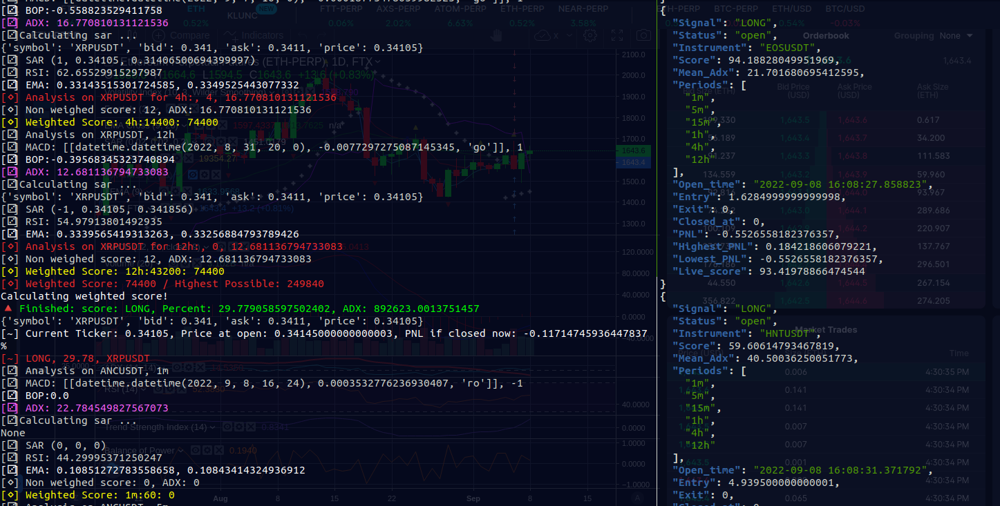

# BitSieve 

### About

BitSieve is a high-performance market analysis toolkit. The idea is to look at the top 30 or 40 crypto markets by volume 
and find the ones that have clear, strong trends. This tool identifies what the best possible markets to trade at the 
moment are. This tool is not intended to do all the TA work for you. It is intended to sort through a tremendous amount 
of information and figure out which markets you ought to look closer at to identify possible profitable trades.

Originally I wrote this specifically to be used with FTX, so it will only evaluate markets that are both present on 
Binance and have perpetual future markets on FTX. Because binance has much better support for technical analysis 
(klines over websockets, for example), the tool is doing all the TA using binance's websocket API. 
Special thanks to the developers of the unicorn-binance-websocket API tool, as this project would not have been possible
without it.

### Methodology

The logic for scoring a market in this program is based on my theory of identifying both trend and strength of trend. 
Trend is identified by creating an average based on what a collection of indicators is reporting. The formulas are: 

<b>TA Score</b>

For each indicator that reports a long signal, add +1 to the score, and subtract -1 for each short signal. Then multiply 
that score by the number of seconds in this period, giving us a weighted score. Likewise, we need to know what the highest 
possible score is for each period, which is the amount of indicators multiplied by the number of seconds in the period. 
Finally, we add all the weighted and highest scores together, then divide those two numbers and convert it into a 
percentage. This is the final score. This gives us a decent idea of what the trend is.

<b>ADX Average</b>

For each period calculate the ADX, multiply it by the number of seconds in the period. Highest ADX is 100, so multiply 
seconds in each period by 100 to get max adx. Divide average adx by max adx, this gives us the average ADX of all 
periods, which gives us a good idea of how strong the trend of this market is.

 ### The Data

Upon identifying a signal, a json object is broadcasting over mqtt to the topics `/signal` and `/stream`. 

<pre>
{
  "Signal": "LONG",
  "Status": "closed",
  "Instrument": "MATICUSDT",
  "Score": 40,
  "Mean_Adx": 21.62,
  "Patterns": [],
  "Periods": [
    "1m",
    "5m",
    "15m",
    "30m",
    "1h",
    "2h"
  ],
  "Open_time": "2022-09-06 17:39:24.006360",
  "Entry": 0.82455,
  "Exit": 0.82425,
  "Closed_at": "2022-09-06 17:51:16.811772",
  "PNL": 0.06063913649868958,
  "Highest_PNL": 0.339579164392702,
  "Lowest_PNL": -0.1819174094960822,
  "Live_score": 40

</pre>

As a general rule of thumb, a mean adx greater than 30 is a decently strong strend, and anything over 40 is a very 
strong trend. The TA score is a bit less obvious to interpret. For automated trading, you probably want to use 
something over 50, but you also want to keep in mind that a high score may also indicate that this trend has been 
going for a while and may exhaust soon. It really depends on the situation.

### Patter Recognition

I am still trying to figure out the best way to handle this. Currently, I consider patters as just another indicator. 
If patterns are not present, then this indicator score is 0. Long patterns +1 and shorts -1. Of course this is hardly 
precise or complete. I think that patterns need to expire. For instance, a hammer on the two hour is not very useful 
six hours later. Currently, if you are using patterns then you may want to periodically restart the program to avoid 
that effect. 

### Usage 

<pre>
usage: engine.py [-h] [-d] [-q] [-m {scalp,standard,precise}] [-t TIMEFRAMES [TIMEFRAMES ...]] [-p PATTERNS_ON [PATTERNS_ON ...]] [-fp FIB_RES] [-ms MIN_SCORE] [-ma MIN_ADX] [-r] [-s SINGLE] [-S SHARD] [-H HOST]

optional arguments:
  -h, --help            show this help message and exit
  -d, --debug           Super verbose output
  -q, --quiet
  -m {scalp,standard,precise}, --mode {scalp,standard,precise}
                        Period settings
  -t TIMEFRAMES [TIMEFRAMES ...], --timeframes TIMEFRAMES [TIMEFRAMES ...]
  -p PATTERNS_ON [PATTERNS_ON ...], --pattern PATTERNS_ON [PATTERNS_ON ...]
  -fp FIB_RES, --fib_res FIB_RES
                        The resolution to calculate fib retrace levels for. Default is the longest period of timeframes.
  -ms MIN_SCORE, -min_score MIN_SCORE
                        If set, only broadcast if score is at least this.
  -ma MIN_ADX, --min_adx MIN_ADX
                        Min average adx
  -r, --reverse         Get lowest volume markets.
  -s SINGLE, --single SINGLE
  -S SHARD, --shard_from SHARD
  -H HOST, --host HOST

</pre>

<b>
How to Use
</b>
Make sure that you are running an mqtt server locally (mosquitto is fine). To start with default options, you can run 
it with no arguments.

The time periods are customizable. There are three default modes:

- Scalp:  ['1m', '3m', '5m', '15m', '30m']
- Standard: ['1m', '5m', '15m', '30m', '1h', '2h']
- Precise: ['1m', '5m', '15m', '1h', '4h', '12h']

Any period that binance's API is supported. Supported periods and their seconds:

<pre>
period_map = [(60, '1m'), (180, '3m'), (300, '5m'), (900, '15m'), (1800, '30m'), (3600, '1h'), (7200, '2h'),
              (14400, '4h'), (21600, '6h'), (43200, '12h'), (86400, '1d'), (259200, '3d'), (604800, '1w'),
              (2592000, '1M')]
</pre>

You can use the `--timeframes` argument to supply your own custom periods or you can use `--mode` to choose one of the 
ones that I programed. If you want to do pattern recognition, use `--patterns`, for example `--patterns 2h 1h`. You can 
also set the min score/adx thresholds with `-ms` and `-ma`. If you want to check the lowest volume markets instead of 
the highest, use `--reverse`. To supply an mqtt daemon other than localhost, use `--host`.

This is an incomplete list of the possible settings, I will write documentation for the rest when I get a chance. 

# bitsieve
============

a high performance market analysis framework

### Custom Indicators

You can easily add your own indicators if you know how to code a little. Talib supports tons of them and is easy to 
use. I will be refactoring this to make this more straightforward, but moderately experienced devs can figure it out.
Make sure that you also add the name of that indicator to the `self.indicators` variable of the `Strategy` class.

### FTX

Do you not have an FTX account yet? Please support my work by using my 
<a href="https://ftx.com/referrals#a=darkerego">referal code</a>: https://ftx.com/referrals#a=darkerego, you 
will get a discount of fees. FTX is definitely the best crypto futures exchange for these reasons:

- Support for many, many crypto markets
- Up to 20x leverage (anything higher is nuts and a scam)
- Forgiving liquidation engine - you will not ever lose more than 50% of your margin with FTX. Every other futures 
exchange will simply take it all. 
- Intuitive interface
- Awesome flexibility. You can use pretty much anything as collateral.
- Hedge any way that you see fit. 

<b>
Find this useful? Consider supporting development: </b>
BTC:3KD3sKiGSyipijVVJ8jVyLYeRDkkTKzKct
ETH:0x0f7274f04d47c5A7cd08AF848e809396ef6B08A5

